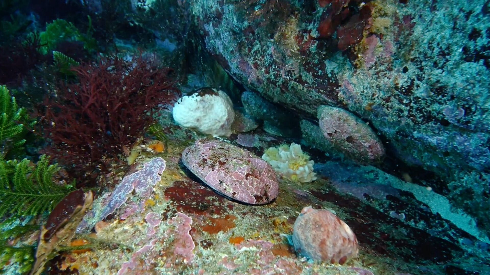

# Datos de Abalones

## Resumen

Este repositorio contiene el dataset de abalones, que se utiliza para predecir la edad de los abalones basándose en mediciones físicas. El dataset incluye varios atributos como longitud, diámetro, altura y pesos, que se utilizan para estimar la edad de los abalones medida en anillos.

## Detalles del Dataset

- **Título**: Datos de Abalones
- **Número de Instancias**: 4177
- **Número de Atributos**: 8

### Atributos

1. **Sexo**: Nominal (M, F, I)
   - M: Macho
   - F: Hembra
   - I: Infantil
2. **Longitud**: Continua (mm)
   - Medida más larga del caparazón
3. **Diámetro**: Continua (mm)
   - Perpendicular a la longitud
4. **Altura**: Continua (mm)
   - Con la carne en el caparazón
5. **Peso total**: Continua (gramos)
   - Abalón entero
6. **Peso sin concha**: Continua (gramos)
   - Peso de la carne
7. **Peso de las vísceras**: Continua (gramos)
   - Peso del intestino (después de sangrar)
8. **Peso de la concha**: Continua (gramos)
   - Después de ser secado
9. **Anillos**: Entero
   - +1.5 da la edad en años

### Estadísticas

- **Longitud**: Min=0.075 mm, Max=0.815 mm, Media=0.524 mm, SD=0.120 mm
- **Diámetro**: Min=0.055 mm, Max=0.650 mm, Media=0.408 mm, SD=0.099 mm
- **Altura**: Min=0.000 mm, Max=1.130 mm, Media=0.140 mm, SD=0.042 mm
- **Peso Total**: Min=0.002 gramos, Max=2.826 gramos, Media=0.829 gramos, SD=0.490 gramos
- **Peso sin Concha**: Min=0.001 gramos, Max=1.488 gramos, Media=0.359 gramos, SD=0.222 gramos
- **Peso de las Vísceras**: Min=0.001 gramos, Max=0.760 gramos, Media=0.181 gramos, SD=0.110 gramos
- **Peso de la Concha**: Min=0.002 gramos, Max=1.005 gramos, Media=0.239 gramos, SD=0.139 gramos
- **Anillos**: Min=1, Max=29, Media=9.934, SD=3.224

### Fuentes

- **Propietarios Originales**: Marine Resources Division, Marine Research Laboratories - Taroona, Department of Primary Industry and Fisheries, Tasmania, Australia
- **Donante**: Sam Waugh, Department of Computer Science, University of Tasmania, Australia
- **Fecha de Recepción**: Diciembre de 1995

### Uso Anterior

El dataset ha sido utilizado en varios estudios y comparaciones:
- **Sam Waugh (1995)**: "Extending and benchmarking Cascade-Correlation" (Tesis de Doctorado, University of Tasmania)
- **David Clark et al. (1996)**: "A Quantitative Comparison of Dystal and Backpropagation" (ACNN'96)

### Información Relevante

Predecir la edad de los abalones a partir de mediciones físicas puede ser un desafío porque la edad se determina contando los anillos en el caparazón, lo que es una tarea que consume tiempo. El dataset incluye valores continuos escalados para facilitar el uso con modelos de aprendizaje automático.

### Valores Faltantes

No hay valores faltantes en el dataset.

## Contacto

Para más información, contacta a:

- **Warwick Nash**: wnash@dpi.tas.gov.au
- **Sam Waugh**: Sam.Waugh@cs.utas.edu.au
